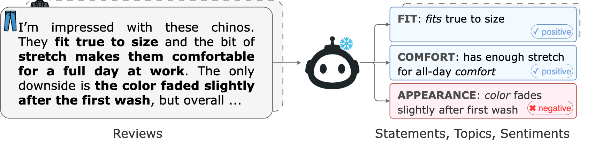

# Statement-Topic-Sentiment Extraction (STS)



Atomic explanatory statements from product reviews — with topic taxonomy and sentiment labels.
Convert raw reviews into **fine-grained atomic statements** labeled with a **domain-specific topic** and **sentiment**.

## Domains & taxonomies

Each domain uses a **fixed topic list** and a unified JSON schema:

```json
[
  {"statement": "...", "topic": "<topic>", "sentiment": "positive|negative|neutral"}
]
```

* **Toys**: safety, age, durability, educational, engagement, materials, functionality, assembly, battery, price.&#x20;
* **Clothing**: fit, material, comfort, appearance, construction, price, care, functionality, shipping, service.&#x20;
* **Beauty**: efficacy, compatibility, ingredients, texture, longevity, color, price, packaging, scent, service.&#x20;
* **Sports**: performance, durability, comfort, fit, material, safety, portability, usability, price, service.&#x20;
* **Cellphones & accessories**: performance, battery, camera, display, specs, durability, software, usability, price, service.&#x20;

Each prompt file also specifies **atomicity rules**, **topic assignment rules**, and **few-shot examples** to ensure consistent extraction.

## Quick start (Toys example)

### Extract atomic statements (LLM)

```bash
cd statement_topic_sentiment

PYTHONPATH=. python sts_extraction.py \
  --model /path/to/Meta-Llama-3-8B-Instruct \
  --prompt_text_file /path/to/prompt.txt \
  --dataset_path /path/to/reviews.json \
  --output_dir /path/to/topics/ \
  --batch_size 32 \
  --max_new_tokens 512
```

**Input format:** JSON/CSV with a review text field (e.g., `review`). The script loads rows, prompts the LLM with the domain prompt, and writes **per-review JSON arrays** of atomic statements following the schema above (topics & examples defined in `toys.txt`).&#x20;

### Build Explanation Ground-truth

```bash
PYTHONPATH=. python build_explanations.py \
    --data_csv ${DATASET_DIR}/${SPLIT}_data.csv \
    --sts_csv ${DATASET_DIR}/sts.csv \
    --output_csv ${DATASET_DIR}/${SPLIT}_explanations.csv \
```

---

## Apply Sentence-Topic-Sentiment to **your** dataset (and new domains)

1. **Write your own domain prompt** (`your_domain.txt`). Define the **accepted topics**, the **atomicity & formatting rules**, **sentiment guidelines**, and include **few-shot examples**. Keep the JSON schema exactly:

   ```json
   [
     {"statement": "...", "topic": "<topic>", "sentiment": "positive|negative|neutral"}
   ]
   ```

   **Minimal prompt skeleton**

   ```txt
   # <Your Domain> — Extraction Prompt (your_domain.txt)

   ACCEPTED TOPICS:
   - topic_1 — short definition
   - topic_2 — short definition
   - ...

   RULES:
   - Split reviews into atomic, present-tense factual statements (one claim per line).
   - Assign exactly one topic from ACCEPTED TOPICS to each statement.
   - Output a single valid JSON array (no prose, no trailing commas).
   - Use only "positive", "negative", or "neutral" for sentiment.

   SENTIMENT GUIDELINES:
   - positive: ...
   - negative: ...
   - neutral: ...

   OUTPUT FORMAT (MUST be valid JSON):
   [
     {"statement": "...", "topic": "<one_of_ACCEPTED_TOPICS>", "sentiment": "positive|negative|neutral"}
   ]

   EXAMPLES:
   Review: "..."
   Output: [
     {"statement": "...", "topic": "topic_1", "sentiment": "positive"},
     ...
   ]
   ```

2. **Map your schema** so your review text is available as one field (e.g., `review`).

3. **Run extraction** with `sts_extraction.py` using your prompt and your data.

4. **Build explanation ground-truth** with `build_explanations.py`using your data.
---

## Illustrative extraction examples

* **Example 1** (From `toys.txt` few-shot guidance.)

  Review: `The plastic edges are sharp and a small piece detached, and the wheels break during play.`
  Output:

  ```json
  [
    {"statement": "has sharp plastic edges", "topic": "safety", "sentiment": "negative"},
    {"statement": "has a small detachable part", "topic": "safety", "sentiment": "negative"},
    {"statement": "wheels break during play", "topic": "durability", "sentiment": "negative"}
  ]
  ```
